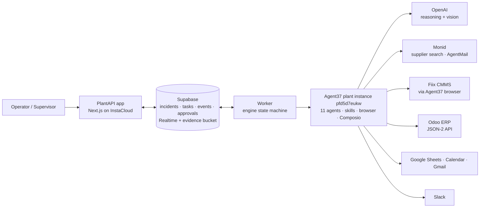

# PlantAPI

**One failure. Eleven agents. One Agent37 plant team. Five sponsors. One approval. Closed.**

## Problem

When a machine fails on a plant floor, the repair itself is often the short part. The long part is the coordination around it. Someone has to work out what broke and check the maintenance history. They find the part in the ERP, and if it isn't in stock, they find a supplier. They have to check the production schedule and find a qualified technician who is actually free. Then they open a work order, stop the line, tell everyone, and confirm the right part went in. Each of those steps lives in a different system: the CMMS, the ERP, spreadsheets, calendars, email and chat. A person stitches them together by hand while the line is down.

## Solution

> **We don't replace your maintenance stack. We replace the manual coordination between it.**

An operator uploads a photo and the alarm text. A team of 11 agents runs on one Agent37 plant instance and does the coordination:

- **Triage** identifies the asset and the failed part.
- **Materials** checks Odoo stock and sources the part through Monid.
- **Reliability, Production, Workforce and Risk** plan in parallel. They read Fiix history, the production schedule in Google Sheets, technician availability in Google Calendar, and the LOTO SOP.
- **Coordinator** resolves the planners' disagreement into one repair plan.

A human approves the plan with one click. After approval:

- **ERP** opens the Fiix work order and blocks the line in Odoo.
- **Procurement** emails the supplier.
- **Dispatch** books the technician and posts to Slack.
- **Verification** checks the technician's completion photo. It rejects the wrong part and accepts the right one. Then it closes the Fiix work order, unblocks Odoo, and the incident is **CLOSED**.

## Demo (60–90 s)

Deployed app (InstaCloud): **https://prod-slice-preview-app-868318-00p2nqk9qcz.compute.instacloud-edge.com**

| Time | What you see |
|---|---|
| 0–10 s | The operator uploads `failure-burned-contactor.jpg` and the alarm for conveyor CV-104 (Crushing Line 2). |
| 10–25 s | The agent graph lights up. Triage reads CV-104, a failed contactor KM104 (part LC1D09BD), electrical, high severity. |
| 25–40 s | Four planners run in parallel. Production wants tomorrow 07:00, the lowest-impact slot in the live Google Sheet. Workforce sees from the live Google Calendar that Sarah Chen has arc-flash training at 07:00 tomorrow. The coordinator picks **today 18:00–19:00**. Materials shows Odoo stock 0, and Monid finds RS - America at $152.64. |
| 40–50 s | The plan card shows each action with its rule: AUTO, APPROVAL or DENY. A DENY example is "jumper the contactor feedback to keep running". The supervisor clicks **Approve**. |
| 50–65 s | A Fiix work order is created on CV-104 through the Agent37 browser. Crushing Line 2 is blocked in Odoo, the supplier email is sent, and the calendar booking and Slack notice go out. |
| 65–80 s | The technician uploads a photo of the wrong part, labelled CHNT NCH8-63 63 A. Verification **rejects** it. The technician uploads the correct LC1-D09-type contactor, and Verification **accepts** it. |
| 80–90 s | The Fiix work order is closed, Odoo is unblocked, and the incident is **CLOSED**. Then 15 s of governance: ALLOW / APPROVE / DENY. |

## Screenshots

All of these come from real runs. Full demo script: [docs/DEMO_SCRIPT.md](docs/DEMO_SCRIPT.md).

| | |
|---|---|
| **Control room: four planners in parallel**  | **Plan card: disagreement and resolution**  |
| **Agent graph**  | **Execution: Fiix WO plus Odoo block**  |
| **CLOSED: 11-agent run `ed54ca93`**  | **/plant: Agent37 instance panels**  |
| **/governance: ALLOW / APPROVE / DENY**  | **/governance: AI lead refused (403)**  |
| **Agent37 live view of the plant browser**  | |

## Architecture



## Why these five sponsors?

**Agent37 runs the workers. OpenAI makes them think. Supabase keeps them coordinated. Monid gives them tools. InstaCloud keeps the product running safely.**

**Agent37.** Every agent turn runs on one Agent37 plant instance, `pfd5d7eukw`. Each of the 11 role skills returns schema-valid output as a real turn. Fiix has no API on our plan, so the instance's built-in browser drives it. The exec and files APIs move evidence back to the app; a screenshot download takes 0.5 s. Google Calendar, Sheets, Gmail and Slack are connected through Agent37's managed Composio: `ca_f-8GUBAQAeDo`, `ca_LfMFRqjxat29`, `ca_mypGGgP3S7oQ` and `ca_zZ1ZSqkFoLXB`. "Add plant" creates a new instance from the `plantapi-agent@1` template. The test instance `hdizdrdslv` was created that way.

**OpenAI.** OpenAI does the reasoning and the photo checks. On the real run (incident `dd94429f-3066-4b38-9cc0-391aaf6a24c4`), Verification rejected the wrong-part photo, reading "CHINT NCH8-63 63 A; expected LC1D09BD 9 A, 24 V DC". It then accepted the correct part with 6/6 checks, and the incident reached CLOSED.

**The full 11-agent run also reached CLOSED on real data** (incident `ed54ca93-9b88-4c09-b0cf-72c7d1940d88`, 15:34 upload → 15:44:57 CLOSED, Agent37 cost $0.13):
- **Planners:** the four ran in parallel. Production read the live sheet, Workforce the live "PlantAPI Technicians" calendar, Reliability the real Fiix WOs 1, 2, 6 and 8, and Materials found RS - America at $152.64 through Monid.
- **Execution:** ERP, Procurement and Dispatch ran in parallel. ERP created Fiix WO 9 and Odoo block `mrp.workcenter.productivity:5`. Procurement sent a real AgentMail email (`<010001a11885342a-…>`).
- **Close:** the correct-part photo was accepted, the Fiix WO was closed, Odoo was unblocked, and the incident reached CLOSED.

**Supabase.** Supabase is the referee between the UI, the worker and the agents. Project `npbcyyudbftyklenxycr` holds incidents, agent_tasks, agent_events, approvals and audit_logs, with Realtime feeding the live activity view, plus the `evidence` storage bucket. The governance decisions are stored too, in `infra_actions`: ALLOW `e8a4477b-…`, APPROVE `d804ba6d-…` and DENY `08ec0f21-…`.

**Monid.** Monid gives the agents tools they don't have built in:
- **Supplier search:** `litescrape /google/shopping` for "LC1D09BD RS Components" returned **RS - America at $152.64** (`scripts/fixtures/monid-LC1D09BD.json`).
- **Supplier email:** procurement sends through AgentMail to our demo inbox `rs-supplier-demo@agentmail.to`. One email per approved incident (message id `<010001a11880c893-…@email.amazonses.com>`), and reruns don't send again.

**InstaCloud.** InstaCloud hosts the app and the worker from a single Dockerfile, and it governs what an AI agent may do to the infrastructure. In the live run with the `branch_specific` policy:
- **ALLOW:** creating an analysis branch (`analysis-20261007222046`).
- **APPROVE:** scaling a service needed a human approval (`05f384af-2ced-4f15-9d7c-f905469cc00a`).
- **DENY:** deleting the project was refused with `project.delete denied by agent policy (HTTP 403)`.

Evidence: `infra/governance/evidence-2026-10-07T22-20-46-232Z.json`.

## Governance

Every action an agent proposes carries an authority rule:

| Rule | Examples |
|---|---|
| **AUTO** | Read history, SOPs and inventory; search suppliers; check availability; draft the work order |
| **APPROVAL** | Purchase, block production in Odoo, schedule an outage, safety-critical work, send the supplier email, book the technician |
| **DENY** | Bypass safety or interlocks, delete records, complete a checkout |

The same model applies to the infrastructure through InstaCloud agent policy, with ALLOW, APPROVE and DENY as above. The AI cannot change its own policy, and the DENY step returned HTTP 403.

The AI lead session tried to act on the approvals itself, using the user's InstaCloud login. InstaCloud refused it. This is the real output, verbatim:

```
$ insta agent approvals deny 05f384af-2ced-4f15-9d7c-f905469cc00a
error: this operation requires a human request (HTTP 403)
$ insta agent approvals approve 9d6f239c-d666-48fd-acbd-3f77ff73b329
error: this operation requires a human request (HTTP 403)
$ insta agent policy protect-branch main
error: agent_policy.update, branch.protection.update denied by agent policy (HTTP 403)
```

The user then ran the same three commands in their own terminal. `insta agent approvals list` and `insta agent policy get` confirmed the results: `05f384af` (service.scale) **denied**, `9d6f239c` (branch.delete of the analysis branch) **granted**, and branch `main` is **protected**.

## How to run

```bash
npm ci
cp .env.example .env.local   # names only; fill in values (never committed)
npx tsx supabase/apply.ts     # migrations + seed
npm run dev                   # app on :3000
npm run worker                # engine (separate terminal)
```

Smoke tests against the real systems:

```bash
npx tsx --env-file=.env --env-file=.env.local scripts/smoke-odoo.ts
npx tsx --env-file=.env --env-file=.env.local scripts/smoke-monid.ts
npx tsx --env-file=.env --env-file=.env.local scripts/smoke-fiix.ts
npx tsx --env-file=.env --env-file=.env.local scripts/smoke-roles-agent37.ts
npx tsx --env-file=.env --env-file=.env.local scripts/smoke-roles-waveA-agent37.ts
```

`scripts/demo-reset.ts` closes open CV-104 work orders, unblocks Crushing Line 2 and archives old incidents. Only the lead runs it, and it refuses to run while any incident is live.

## Honest status

- **The RS product page isn't confirmed in the browser.** RS blocks the instance's datacenter IP with a DataDome CAPTCHA and Akamai "Access Denied" (screenshot `evidence/rs-LC1D09BD-1791412430802.png`). We don't try to get around bot walls. The Monid search result is the supplier evidence.
- **The part's lead time isn't confirmed.** None of the 20 shopping results gives a delivery date, so `lead_time` is "unknown" and the repair window is conditional on the part arriving. In the 11-agent run `ed54ca93`, the coordinator left the window blank for this reason, so Dispatch's calendar booking and Slack notice were blocked. The fix (a conditional window) is in progress in the core engine.
- **Phone calls are not used.** The follow-up call when the technician doesn't acknowledge was dropped by decision.
- **Fiix work orders are assigned to the owner account** ("ali amjad"), with "Technician: Sarah Chen (Electrical)" in the work order text. There is no separate Fiix user for the technician.
- **There is one plant instance** (`pfd5d7eukw`). "Add plant" has been proven, but the demo runs one plant.
- **The supplier price is the real one:** $152.64. An earlier plan figure of $29.49 was a guess and has been replaced.
- **Supplier email goes only to our demo AgentMail inbox,** never to RS. Nothing is ever purchased.

## Photo credits

Wikimedia Commons (see `seed/photos/CREDITS.md`):

- `failure-burned-contactor.jpg`: "Burned Contactor-01ASD.jpg" by Asurnipal, CC BY-SA 4.0.
- `completion-wrong-part.jpg`: "Contactor NCH8-63.JPG" by Dmitry G, public domain.
- `completion-correct-part.jpg`: "JLC1-D09-10.jpg" by Редактор1511, CC BY-SA 4.0.

## License

MIT — see [LICENSE](LICENSE). Photo credits: [seed/photos/CREDITS.md](seed/photos/CREDITS.md) (CC BY-SA photos keep their own licence).
