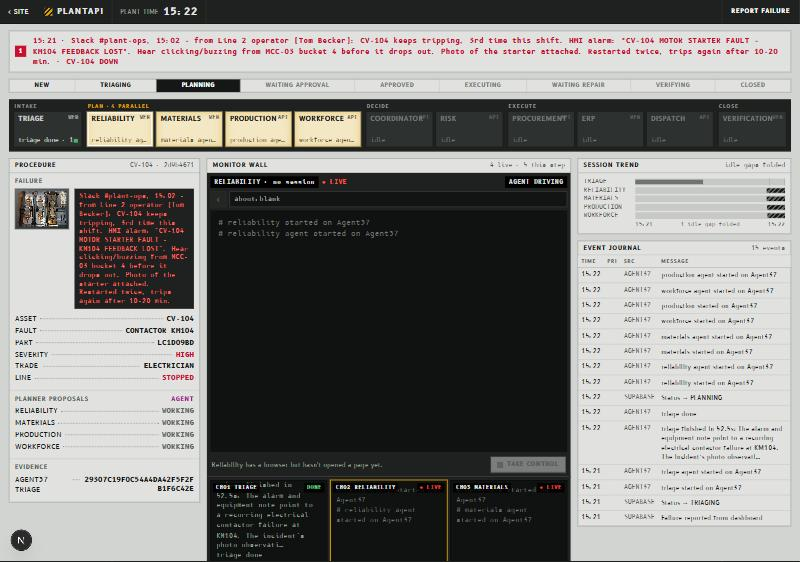
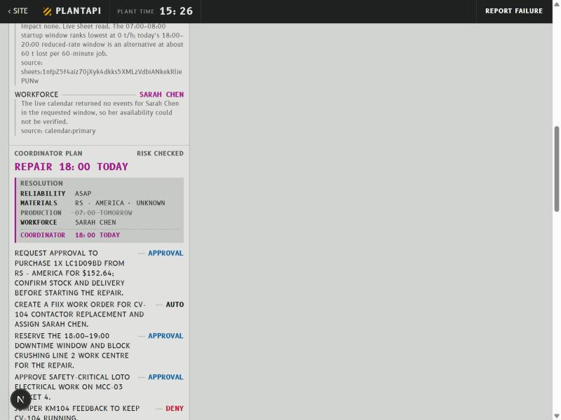
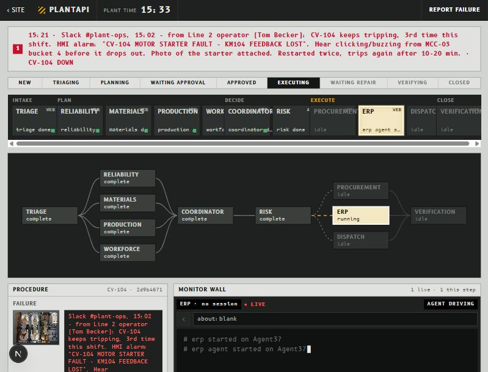
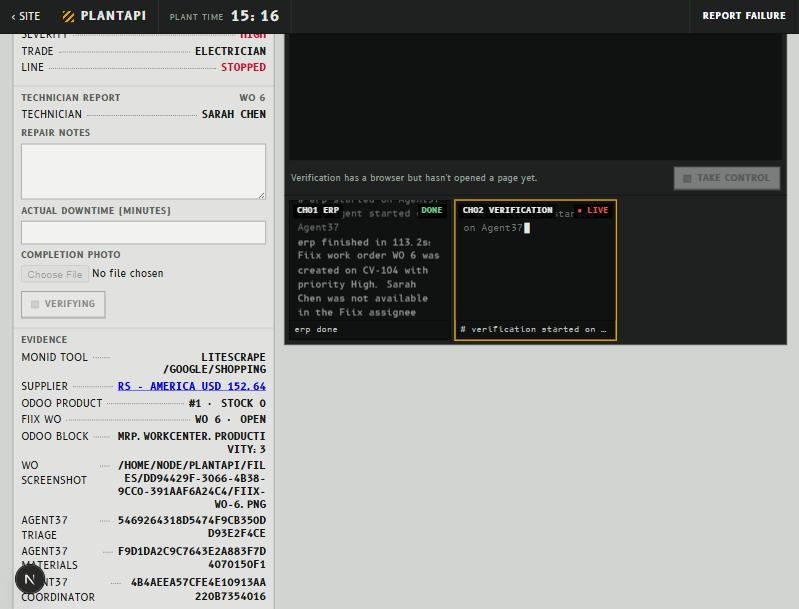
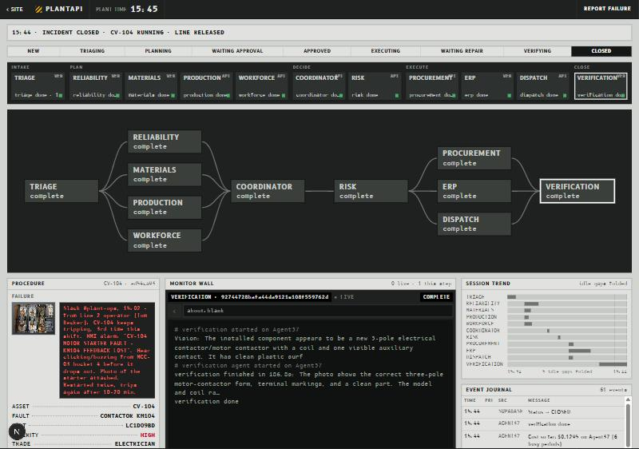
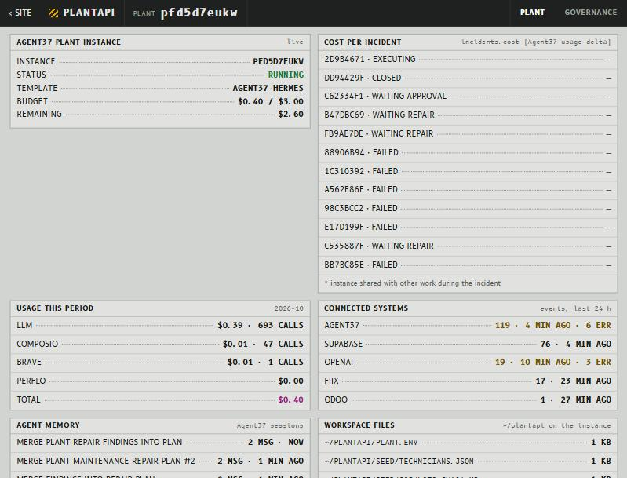
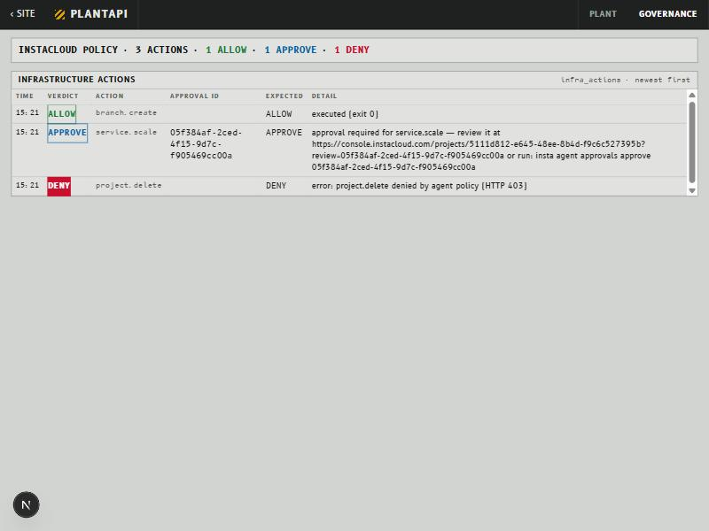
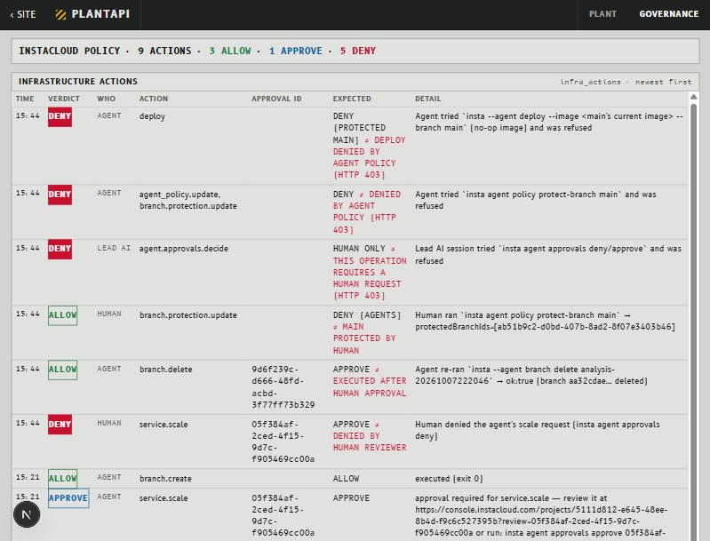
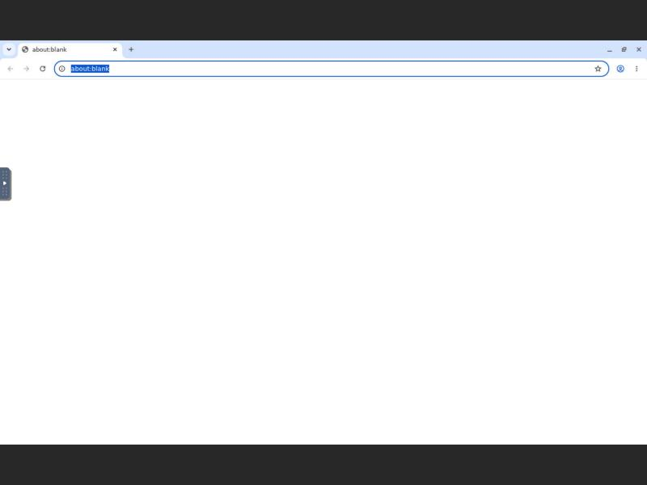
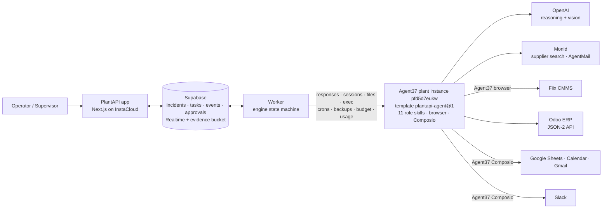

# PlantAPI

**One failure. Eleven agents. One Agent37 plant team. Five sponsors. One approval. Closed.**

PlantAPI gives an industrial plant its own AI maintenance team. **All 11 agents run on Agent37.** An operator uploads a photo of a failure. The agents diagnose it, source the part, plan the repair, open the work order, book the technician, check the repair photo and close everything out. A human approves once.

| | |
|---|---|
| **Live app (InstaCloud)** | https://prod-slice-preview-app-868318-00p2nqk9qcz.compute.instacloud-edge.com |
| **Pitch deck** | https://claude.ai/artifact/C5ktBwzsBfRcGbA5tgefaR · source in [`docs/pitch/`](docs/pitch/README.md) |
| **Demo script** | [`docs/DEMO_SCRIPT.md`](docs/DEMO_SCRIPT.md) |
| **Proof run** | 11-agent incident `ed54ca93-9b88-4c09-b0cf-72c7d1940d88`: upload 15:34 → **CLOSED 15:44:57**, on real systems only. **Agent37 cost: $0.13.** |

**Contents:**
- [Problem](#problem)
- [Solution](#solution)
- [Sponsor integration map](#sponsor-integration-map)
- [Agent37: the whole team runs here](#agent37-the-whole-team-runs-here)
- [OpenAI](#openai-how-the-agents-think-and-see)
- [Supabase](#supabase-the-referee)
- [Monid](#monid-tools-for-the-outside-world)
- [InstaCloud](#instacloud-hosting-and-governance)
- [Demo](#demo-6090-s)
- [Architecture](#architecture)
- [Governance](#governance)
- [How to run](#how-to-run)
- [Honest status](#honest-status)

---

## Problem

On **August 11, 2025** an explosion at U.S. Steel's Clairton Coke Works killed two workers, injured 11 and caused $52M of damage. On July 8 a worker had found a leak in a 1953 gas valve. The valve was patched and its replacement was planned. **The replacement never got scheduled in time.** Thirty-four days later, it exploded. The U.S. Chemical Safety Board's final report came out in August 2026.

That is the gap PlantAPI closes. When a machine fails, the repair is often the short part; the coordination around it is the long part. Someone has to:
- work out what broke and check the maintenance history;
- find the part in the ERP and, if it isn't in stock, find a supplier;
- check the production schedule and find a qualified technician who is actually free;
- open a work order, stop the line and tell everyone;
- confirm the right part went in.

Each step lives in a different system: the CMMS, the ERP, spreadsheets, calendars, email and chat. A person stitches them together by hand while the line is down.

## Solution

> **We don't replace your maintenance stack. We replace the manual coordination between it.**

An operator uploads a photo and the alarm text. **Eleven agents run on one Agent37 plant instance** and do the coordination:

| Phase | Agent | What it does | Systems it uses (through Agent37) |
|---|---|---|---|
| Intake | **Triage** | Identifies the asset, failed part, failure type and severity | OpenAI vision, Fiix asset list |
| Plan, in parallel | **Reliability** | Finds repeat failures and the likely root cause | Fiix work order history (Agent37 browser), SOP files |
| Plan, in parallel | **Materials** | Checks stock and sources the part | Odoo JSON-2 API, **Monid** supplier search |
| Plan, in parallel | **Production** | Finds the lowest-impact outage window | Google Sheets (Agent37 Composio) |
| Plan, in parallel | **Workforce** | Finds a qualified technician who is free | Google Calendar (Agent37 Composio) |
| Decide | **Coordinator** | Resolves the planners' disagreement into one plan | OpenAI strict JSON |
| Decide | **Risk** | Tags each action AUTO / APPROVAL / DENY, applies lockout/tagout | Authority rules, LOTO SOP |
| *Human* | **Supervisor** | **One click: Approve** | PlantAPI control room |
| Execute, in parallel | **ERP** | Opens the Fiix work order and blocks the line in Odoo | **Agent37 browser** → Fiix, Odoo API |
| Execute, in parallel | **Procurement** | Emails the supplier | **Monid** AgentMail |
| Execute, in parallel | **Dispatch** | Books the technician and posts the notice | Google Calendar, Slack (Agent37 Composio), **Agent37 cron** follow-up |
| Close | **Verification** | Checks the completion photo, rejects the wrong part, closes everything | OpenAI vision, Fiix (browser), Odoo |

The role instructions live in [`agent/skills/roles/`](agent/skills/roles/), one file per agent. Each ends in a strict `ROLE_OUTPUT` JSON contract.

---

## Sponsor integration map

**Agent37 runs the workers. OpenAI makes them think. Supabase keeps them coordinated. Monid gives them tools. InstaCloud keeps the product running safely.**

| Sponsor | Its job in PlantAPI | Where it is in the code | Proof in this repo |
|---|---|---|---|
| **Agent37** | The runtime for all 11 agents: turns, sessions, skills, browser, files, exec, Composio apps, crons, backups, budgets, usage, templates, live view, new plants | [`lib/agent37/`](lib/agent37/), [`lib/agent37/provision/`](lib/agent37/provision/), [`agent/skills/`](agent/skills/), [`agent/image/`](agent/image/), [`lib/engine/`](lib/engine/) | [`infra/evidence/`](infra/evidence/), [`agent/image/AGENT37_API.md`](agent/image/AGENT37_API.md), `scripts/smoke-roles-agent37.ts`, `scripts/smoke-roles-waveA-agent37.ts`, `scripts/smoke-fiix.ts` |
| **OpenAI** | Vision diagnosis, strict-JSON plans, photo verification | [`lib/ai/`](lib/ai/) | `scripts/smoke-roles.ts`, incident `dd94429f` |
| **Supabase** | State machine, Realtime feed, approvals, audit log, evidence storage | [`supabase/`](supabase/), [`lib/db/`](lib/db/), [`app/api/`](app/api/) | migrations in `supabase/migrations/` |
| **Monid** | Supplier search, supplier email (AgentMail) | [`lib/tools/monid.ts`](lib/tools/monid.ts), [`agent/skills/monid/`](agent/skills/monid/SKILL.md) | `scripts/fixtures/monid-LC1D09BD.json`, `scripts/smoke-monid.ts`, `scripts/smoke-agentmail.ts` |
| **InstaCloud** | Hosting and AI governance (ALLOW / APPROVE / DENY) | [`Dockerfile`](Dockerfile), [`scripts/deploy.sh`](scripts/deploy.sh), [`lib/infra/`](lib/infra/), [`infra/`](infra/) | [`infra/governance/`](infra/governance/) |

---

## Agent37: the whole team runs here

Agent37 isn't one feature in PlantAPI; it is where the product runs. **Every agent turn, tool call, browser session, file, memory, schedule and checkpoint happens on the Agent37 plant instance `pfd5d7eukw`.** Our own backend is only the referee: it stores state in Supabase and asks the human for approval.

### Agent37 features we use

| # | Agent37 feature | Endpoint(s) | What PlantAPI does with it | Code |
|---|---|---|---|---|
| 1 | **Agent turns** (Responses API) | `POST https://{id}.agent37.app/v1/responses` | Every one of the 11 agents runs as a real turn on the plant instance | `lib/agent37/index.ts` (`createAgent37Client`), `lib/engine/flow.ts` |
| 2 | **Sessions** (agent memory) | `GET /v1/sessions`, `GET /v1/sessions/{id}` | Each agent keeps its context in a session; session ids are stored on the incident; the retry turn reuses the same session | `lib/agent37/crons.ts` (`getSession`, `lastAssistantText`) |
| 3 | **Skills on the instance** | Files API | 11 role skills plus Fiix, Odoo, Monid, Calendar, Sheets, Gmail and Slack skills live in `~/plantapi/skills/` on the instance | `agent/skills/`, `lib/agent37/sync-instance.ts` |
| 4 | **Built-in browser** | (inside the agent turn) | Logs into the **Fiix CMMS**, which has no API on our plan; creates, assigns and closes work orders; reads work order history | `agent/skills/fiix/SKILL.md`, `scripts/smoke-fiix.ts` |
| 5 | **Exec API** | `POST https://api.agent37.com/v1/instances/{id}/exec` | Takes backend-side browser screenshots, inspects the workspace, installs the Monid CLI | `lib/agent37/provision/add-plant.ts` (`execOn`), `lib/agent37/sync-instance.ts` |
| 6 | **Files API** | `POST /v1/files`, `GET https://{id}.agent37.app/v1/files/content?path=` | Uploads photos, SOPs and seed data; downloads work-order screenshots as evidence (about 0.5 s each) | `lib/agent37/index.ts`, `lib/agent37/provision/add-plant.ts` (`putFile`) |
| 7 | **Managed app connections (Composio)** | `agent37.com/mcp/composio` | Google Calendar, Google Sheets, Gmail and Slack, with no OAuth app of our own | `agent/skills/{calendar,sheets,gmail,slack}.md` |
| 8 | **Platform crons** | `POST/GET/DELETE /v1/crons`, `/v1/runs` | One-shot follow-up after Dispatch: wakes the instance, checks Slack for the technician's ack, and triggers a reminder if there is none | `lib/agent37/crons.ts`, `lib/engine/depth.ts` |
| 9 | **Backups** | `POST/GET /v1/instances/{id}/backups` | Checkpoints the whole plant instance **after approval, before any real system is touched** | `lib/agent37/provision/backup.ts` (`createCheckpoint`), `lib/engine/depth.ts` (`ensureCheckpoint`) |
| 10 | **Budgets** | `GET/PUT /v1/instances/{id}/budget` | Caps spend per plant ($3/month on the demo plant, $1 on test plants) | `lib/agent37/provision/budget.ts` |
| 11 | **Usage** | `GET /v1/instances/{id}/usage` | Records cost per incident and spend by integration (LLM, Composio, search) | `lib/engine/cost.ts` |
| 12 | **Custom templates** | `/v1/templates`, `/v1/template-builds/{id}/start`, `/logs` | Built `plantapi-agent@1`: the hermes base plus the Monid CLI and the skills directory | `agent/image/plantapi-agent/Dockerfile`, `lib/agent37/provision/build-templates.ts`, `templates.ts` |
| 13 | **Instances: "Add plant"** | `POST/GET/DELETE /v1/instances` | Creates a new plant instance from the template, with skills preloaded, auto-sleep and its own budget | `lib/agent37/provision/add-plant.ts` (`addPlant`, `removePlant`) |
| 14 | **Live view (desktop)** | `GET /v1/instances/{id}/signed-url` → noVNC | Built `hermes-vnc-desktop@1` so a supervisor can watch the agent's browser live | `agent/image/hermes-vnc-desktop/`, `templates.ts` (`getLiveViewUrl`) |
| 15 | **Health, metrics and logs** | `GET https://{id}.agent37.app/v1/health`, instance metrics and logs | Shown on the `/plant` page | `app/(dashboard)/plant/`, `app/components/plant/` |

### How one incident uses Agent37, step by step

1. **Intake.** The photo is uploaded to the plant instance through the **Files API**. The worker claims the Triage task from Supabase and runs it as an **Agent37 turn** with the `triage` skill.
2. **Planning in parallel.** Four **Agent37 turns** run at once on the same instance:
   - **Reliability** opens Fiix in the **Agent37 browser** and reads past work orders (real WOs 1, 2, 6 and 8).
   - **Materials** calls Odoo, then the **Monid CLI preinstalled in our Agent37 template**.
   - **Production** reads the live schedule from Google Sheets through **Agent37 Composio**.
   - **Workforce** reads the live "PlantAPI Technicians" calendar through **Agent37 Composio**.
3. **Decision.** The Coordinator and Risk agents run as **Agent37 turns** and return a strict-JSON plan with an AUTO / APPROVAL / DENY tag on every action.
4. **Approval → checkpoint.** The supervisor approves. Before any agent acts, the engine takes an **Agent37 on-demand backup** of the instance. Real run: `Checkpoint saved (backup 0bf72f6cc5ee1c4f538e)`, 262 MB in 15.4 s.
5. **Execution in parallel.**
   - **ERP** drives the **Agent37 browser** to create the Fiix work order (real WO 9 in the 11-agent run) and blocks Crushing Line 2 in Odoo.
   - **Procurement** sends the supplier email through Monid AgentMail.
   - **Dispatch** books the technician in Google Calendar and posts to Slack through **Agent37 Composio**. Real run: Calendar event `bepdjqub6o699a1rgp8aqr9q54`, Slack message ts `1791413486.440729`.
6. **Follow-up.** The engine creates a one-shot **Agent37 cron** (real `6a8f63c4eb01`). It wakes the instance, checks Slack for the technician's acknowledgement and queues one reminder if there is none. Real reminder: Gmail `1a1188cc00050c99`, Slack ts `1791413402.635529`. The cron is deleted after it fires.
7. **Evidence.** The worker pulls browser screenshots off the instance with **exec + the Files API** and shows them in the control room.
8. **Close.** Verification runs as an **Agent37 turn**. It checks the technician's photo, then uses the **Agent37 browser** to close the Fiix work order and unblocks Odoo. The incident's **Agent37 usage** is recorded: **$0.13** for the full 11-agent run.

### Reliability built around Agent37

- **Valid output or nothing.** If a turn returns invalid JSON, the engine retries once **in the same Agent37 session**, asking only for the JSON. If that fails too, the task is FAILED. No other model patches the output, and nothing is marked complete without a valid result from Agent37.
- **Concurrency.** The worker runs three Agent37 turns at once, and the parallel executors share one checkpoint.
- **Idempotent sync.** `npx tsx lib/agent37/sync-instance.ts` pushes the skills, seed files, plant environment and the Monid login to the instance, and never prints a secret value.
- **Safe provisioning.** `templates.ts` refuses to delete protected instances (`assertNotProtected`). Test plants are created with auto-sleep and a $1 cap, then deleted (evidence: `infra/evidence/add-plant.txt`).

### Agent37 proof in this repo

| What | Evidence |
|---|---|
| Custom template `plantapi-agent@1` (build `tb_68b3d93031d974774143`), "Add plant" on instance `hdizdrdslv` with skills and `monid 0.1.7` preinstalled, then deleted | [`infra/evidence/add-plant.txt`](infra/evidence/add-plant.txt) |
| Live view template `hermes-vnc-desktop@1` (build `tb_5ccd9eeaae70c1d63542`), Chrome watched over noVNC on instance `hj9wbnzkte` | [`infra/evidence/live-view.txt`](infra/evidence/live-view.txt), [screenshot](docs/screenshots/platform/live-view-hj9wbnzkte.jpg) |
| Budget cap $3 and spend read live; on-demand backup `1d7078da8512977edbf0` (259.7 MB) | [`infra/evidence/budget-backup.txt`](infra/evidence/budget-backup.txt) |
| All 11 role skills return schema-valid output as real Agent37 turns | `scripts/smoke-roles-agent37.ts`, `scripts/smoke-roles-waveA-agent37.ts` |
| Real Fiix work order created and closed on CV-104 through the Agent37 browser | `scripts/smoke-fiix.ts`, [screenshot](docs/screenshots/ui/05-dd94429f-fiix-wo6-odoo-block-verifying.jpg) |
| `/plant` page: instance, budget, usage by integration, sessions, crons, backups, workspace files | [screenshot](docs/screenshots/ui/10-plant-panels.jpg) |
| Agent37 API notes we worked from | [`agent/image/AGENT37_API.md`](agent/image/AGENT37_API.md), [`lib/agent37/provision/README.md`](lib/agent37/provision/README.md) |

---

## OpenAI: how the agents think and see

| Use | Detail |
|---|---|
| **Vision diagnosis** | Triage reads `failure-burned-contactor.jpg` and returns CV-104, contactor KM104, part LC1D09BD, electrical, high severity, electrician |
| **Strict-JSON reasoning** | `chatJSON` uses zod schemas converted to strict `json_schema` output. The Coordinator settles the planners' disagreement: Production wants tomorrow 07:00, but Sarah Chen has arc-flash training then, so it picks **today 18:00–19:00** |
| **Photo verification** | Verification compares the technician's photo with the expected part. Real run (incident `dd94429f-3066-4b38-9cc0-391aaf6a24c4`): **REJECTED** "CHINT NCH8-63 63 A; expected LC1D09BD 9 A, 24 V DC", then **ACCEPTED** the correct part with 6/6 checks |
| **Pre-check** | A quick vision check on each photo before the Agent37 turn runs |

Code: [`lib/ai/index.ts`](lib/ai/index.ts) (`createAiGateway`, `extractLastJson`, `imageToDataUrl`). Tests: `lib/ai/ai.test.ts`, `scripts/smoke-roles.ts`.

## Supabase: the referee

Supabase project `npbcyyudbftyklenxycr` is the shared state between the UI, the worker and the Agent37 agents.

- **State machine tables:** `plants` (with `agent37_instance_id`), `assets`, `incidents`, `agent_tasks`, `agent_events`, `approvals`, `audit_logs`, `parts`, `technicians` and `infra_actions`. The worker claims rows from `agent_tasks` and runs each one as an Agent37 turn.
- **Realtime:** `incidents`, `agent_tasks` and `agent_events` stream to the control room and the animated agent graph.
- **Storage:** the `evidence` bucket holds the technicians' completion photos.
- **Governance record:** InstaCloud decisions are stored in `infra_actions`: ALLOW `e8a4477b-…`, APPROVE `d804ba6d-…`, DENY `08ec0f21-…`.
- **Operations:** the worker writes a heartbeat every 15 s, which `/api/health` reports. `worker_control` lets a deploy drain the worker safely: it finishes running Agent37 turns, then stops.

Code: [`supabase/migrations/`](supabase/), [`lib/db/`](lib/db/), [`app/api/incidents/`](app/api/incidents/), [`app/api/health/`](app/api/health/), [`worker/`](worker/).

## Monid: tools for the outside world

- **Supplier search:** Odoo shows stock 0, so the Materials agent runs Monid `litescrape /google/shopping` for "LC1D09BD RS Components". Result: **RS - America, $152.64** ([`scripts/fixtures/monid-LC1D09BD.json`](scripts/fixtures/monid-LC1D09BD.json)).
- **Supplier email:** after approval, Procurement sends through Monid **AgentMail** to our demo inbox `rs-supplier-demo@agentmail.to`. It sends once per approved incident, and reruns don't send again. Real message id: `<010001a11885342a-…>`. Nothing is ever purchased.
- **Inside Agent37:** the Monid CLI is baked into our `plantapi-agent` template, so agents call it directly from the instance.

Code: [`lib/tools/monid.ts`](lib/tools/monid.ts) (`searchSuppliers`, `runShoppingSearch`), [`agent/skills/monid/SKILL.md`](agent/skills/monid/SKILL.md). Smoke tests: `scripts/smoke-monid.ts`, `scripts/smoke-agentmail.ts`, `scripts/smoke-procurement-send.ts`.

## InstaCloud: hosting and governance

- **Hosting:** one [`Dockerfile`](Dockerfile) runs `next start` and the worker, deployed with [`scripts/deploy.sh`](scripts/deploy.sh). Live at the URL at the top of this page.
- **Governance:** with the `branch_specific` agent policy:
  - **ALLOW:** creating an analysis branch environment (`analysis-20261007222046`).
  - **APPROVE:** scaling a service needed a human approval (`05f384af-2ced-4f15-9d7c-f905469cc00a`).
  - **DENY:** deleting the project was refused with `project.delete denied by agent policy (HTTP 403)`.
- **It stopped our own AI.** Our AI lead session tried to approve its own requests and change the policy. InstaCloud returned HTTP 403 "requires a human request" (verbatim output under [Governance](#governance)).

Code and evidence: [`lib/infra/governance-demo.ts`](lib/infra/governance-demo.ts), [`lib/infra/infra-actions.ts`](lib/infra/infra-actions.ts), [`infra/governance/`](infra/governance/) (`evidence-2026-10-07T22-20-46-232Z.json`, `POLICY_PLAN.md`), [`infra/deploy/`](infra/deploy/). UI: `/governance`.

---

## Demo (60–90 s)

| Time | What you see |
|---|---|
| 0–10 s | The operator uploads `failure-burned-contactor.jpg` and the alarm for conveyor CV-104 (Crushing Line 2). |
| 10–25 s | The agent graph lights up. Triage (an Agent37 turn with OpenAI vision) reads CV-104, a failed contactor KM104 (part LC1D09BD), electrical, high severity. |
| 25–40 s | Four planners run in parallel on Agent37. Production wants tomorrow 07:00 from the live Google Sheet. Workforce sees that Sarah Chen has arc-flash training then. The coordinator picks **today 18:00–19:00**. Materials shows Odoo stock 0, and Monid finds RS - America at $152.64. |
| 40–50 s | The plan card shows each action with its rule: AUTO, APPROVAL or DENY. A DENY example is "jumper the contactor feedback to keep running". The supervisor clicks **Approve**, and an Agent37 checkpoint is saved. |
| 50–65 s | A Fiix work order is created on CV-104 through the Agent37 browser. Crushing Line 2 is blocked in Odoo, the supplier email is sent, the calendar booking and Slack notice go out, and the follow-up cron is scheduled. |
| 65–80 s | The technician uploads a photo of the wrong part, labelled CHNT NCH8-63 63 A. Verification **rejects** it. The technician uploads the correct LC1-D09-type contactor, and Verification **accepts** it. |
| 80–90 s | The Fiix work order is closed, Odoo is unblocked, and the incident is **CLOSED**, with the Agent37 cost shown. Then 15 s of governance: ALLOW / APPROVE / DENY. |

## Screenshots

All of these come from real runs.

| | |
|---|---|
| **Control room: four planners in parallel**  | **Plan card: disagreement and resolution**  |
| **Agent graph**  | **Execution: Fiix WO plus Odoo block**  |
| **CLOSED: 11-agent run `ed54ca93`**  | **/plant: Agent37 instance panels**  |
| **/governance: ALLOW / APPROVE / DENY**  | **/governance: AI lead refused (403)**  |
| **Agent37 live view of the plant browser**  | |

## Architecture



**Repo layout:**

```
agent/skills/roles/        11 role skills (triage … verification), run on Agent37
agent/skills/{fiix,odoo,monid}/  tool skills; calendar/sheets/gmail/slack.md use Agent37 Composio
agent/image/               Agent37 custom templates: plantapi-agent, hermes-vnc-desktop
lib/agent37/               Agent37 client (responses, sessions, files, exec), crons, instance sync
lib/agent37/provision/     templates, add-plant, budget, backup (Agent37 platform API)
lib/engine/                state machine, prompts, cost per incident, checkpoint + cron depth
lib/ai/                    OpenAI gateway (chat, strict JSON, vision)
lib/tools/                 Monid and Odoo clients
lib/infra/                 InstaCloud governance demo + infra_actions
supabase/                  migrations + seed
worker/                    engine worker (claims agent_tasks, runs Agent37 turns)
app/                       Next.js UI + API (control room, /plant, /governance)
infra/                     deploy, governance and Agent37 evidence
```

## Governance

Every action an agent proposes carries an authority rule:

| Rule | Examples |
|---|---|
| **AUTO** | Read history, SOPs and inventory; search suppliers; check availability; draft the work order |
| **APPROVAL** | Purchase, block production in Odoo, schedule an outage, safety-critical work, send the supplier email, book the technician |
| **DENY** | Bypass safety or interlocks, delete records, complete a checkout |

On Agent37, spend is capped per plant by the instance budget. On InstaCloud, the same model applies to the infrastructure through agent policy: ALLOW, APPROVE and DENY. The AI cannot change its own policy.

The AI lead session tried to act on the approvals itself, using the user's InstaCloud login. InstaCloud refused it. This is the real output, verbatim:

```
$ insta agent approvals deny 05f384af-2ced-4f15-9d7c-f905469cc00a
error: this operation requires a human request (HTTP 403)
$ insta agent approvals approve 9d6f239c-d666-48fd-acbd-3f77ff73b329
error: this operation requires a human request (HTTP 403)
$ insta agent policy protect-branch main
error: agent_policy.update, branch.protection.update denied by agent policy (HTTP 403)
```

The user then ran the same three commands in their own terminal. `insta agent approvals list` and `insta agent policy get` confirmed the results: `05f384af` (service.scale) **denied**, `9d6f239c` (branch.delete of the analysis branch) **granted**, and branch `main` is **protected**.

## How to run

```bash
npm ci
cp .env.example .env.local   # names only; fill in values (never committed)
npx tsx supabase/apply.ts     # migrations + seed
npx tsx lib/agent37/sync-instance.ts   # push skills, seed files and the Monid login to the Agent37 instance
npm run dev                   # app on :3000
npm run worker                # engine (separate terminal)
```

Smoke tests against the real systems:

```bash
npx tsx --env-file=.env --env-file=.env.local scripts/smoke-roles-agent37.ts        # role skills as Agent37 turns
npx tsx --env-file=.env --env-file=.env.local scripts/smoke-roles-waveA-agent37.ts  # all 11 agents on Agent37
npx tsx --env-file=.env --env-file=.env.local scripts/smoke-fiix.ts                 # Fiix WO via the Agent37 browser
npx tsx --env-file=.env --env-file=.env.local scripts/smoke-odoo.ts
npx tsx --env-file=.env --env-file=.env.local scripts/smoke-monid.ts
npx tsx --env-file=.env --env-file=.env.local scripts/smoke-agentmail.ts
```

`scripts/demo-reset.ts` closes open CV-104 work orders, unblocks Crushing Line 2 and archives old incidents. Only the lead runs it, and it refuses to run while any incident is live.

## Honest status

- **The RS product page isn't confirmed in the browser.** RS blocks the Agent37 instance's datacenter IP with a DataDome CAPTCHA and Akamai "Access Denied" (screenshot `evidence/rs-LC1D09BD-1791412430802.png`). We don't try to get around bot walls. The Monid search result is the supplier evidence.
- **The part's lead time isn't confirmed.** None of the 20 shopping results gives a delivery date, so `lead_time` is "unknown" and the repair window depends on the part arriving. Dispatch now books conditional windows, stating the condition.
- **Phone calls are not used.** The follow-up call when the technician doesn't acknowledge was dropped by decision; the Agent37 cron sends a Slack and Gmail reminder instead.
- **Fiix work orders are assigned to the owner account** ("ali amjad"), with "Technician: Sarah Chen (Electrical)" in the work order text. There is no separate Fiix user for the technician.
- **There is one plant instance** (`pfd5d7eukw`). "Add plant" has been proven on `hdizdrdslv`, but the demo runs one plant.
- **Agent37 has no connections endpoint** (it returns 404), so the `/plant` page shows connected systems from agent events instead.
- **Supplier email goes only to our demo AgentMail inbox,** never to RS. Nothing is ever purchased.

## Photo credits

Wikimedia Commons (see `seed/photos/CREDITS.md`):

- `failure-burned-contactor.jpg`: "Burned Contactor-01ASD.jpg" by Asurnipal, CC BY-SA 4.0.
- `completion-wrong-part.jpg`: "Contactor NCH8-63.JPG" by Dmitry G, public domain.
- `completion-correct-part.jpg`: "JLC1-D09-10.jpg" by Редактор1511, CC BY-SA 4.0.

## License

MIT — see [LICENSE](LICENSE). Photo credits: [seed/photos/CREDITS.md](seed/photos/CREDITS.md) (CC BY-SA photos keep their own licence).
